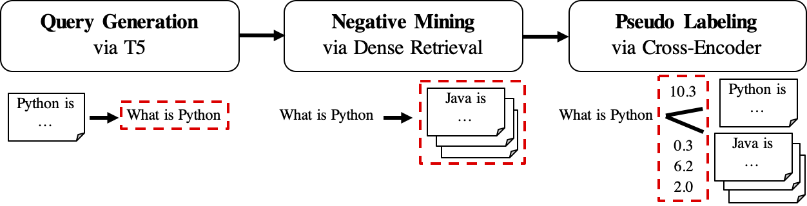

# Generative Pseudo Labeling (GPL)
GPL is an unsupervised domain adaptation method for training dense retrievers. It is based on query generation and pseudo labeling with powerful cross-encoders. To train a domain-adapted model, it needs only the unlabeled target corpus and can achieve significant improvement over zero-shot models.

For more information, checkout our publication:
- [GPL: Generative Pseudo Labeling for Unsupervised Domain Adaptation of Dense Retrieval](https://arxiv.org/abs/2112.07577) (ArXiv 2021)

## Installation
One can either install GPL via `pip`
```bash
pip install gpl
```
or via `git clone`
```bash
git clone https://github.com/UKPLab/gpl.git && cd gpl
pip install -e .
```

## Usage
GPL accepts data in the [BeIR](https://github.com/UKPLab/beir)-format. For example, we can download the [FiQA](https://sites.google.com/view/fiqa/) dataset hosted by BeIR:
```bash
wget https://public.ukp.informatik.tu-darmstadt.de/thakur/BEIR/datasets/fiqa.zip
unzip fiqa.zip
head -n 2 fiqa/corpus.jsonl  # One can check this data format. Actually GPL only need this `corpus.jsonl` as data input for training.
```
Then we can either use the `python -m` function to run GPL training directly:
```bash
export dataset="fiqa"
python -m gpl.train \
    --path_to_generated_data "generated/$dataset" \
    --base_ckpt 'distilbert-base-uncased' \
    --batch_size_gpl 32 \
    --gpl_steps 140000 \
    --output_dir "output/$dataset" \
    --evaluation_data "./$dataset" \
    --evaluation_output "evaluation/$dataset" \
    --generator "BeIR/query-gen-msmarco-t5-base-v1" \
    --retrievers "msmarco-distilbert-base-v3" "msmarco-MiniLM-L-6-v3" \
    --cross_encoder "cross-encoder/ms-marco-MiniLM-L-6-v2" \
    --qgen_prefix "qgen" \
    --do_evaluation \
    # --use_amp   # Use this for efficient training if the machine supports AMP

# One can run `python -m gpl.train --help` for the information of all the arguments
# To reproduce the experiments in the paper, set `base_ckpt` to "GPL/msmarco-distilbert-margin-mse" (https://huggingface.co/GPL/msmarco-distilbert-margin-mse)
```
or import GPL's trainining method in a python script:
```python
import gpl

dataset = 'fiqa'
gpl.train(
    path_to_generated_data=f"generated/{dataset}",
    base_ckpt='distilbert-base-uncased',  
    # base_ckpt='GPL/msmarco-distilbert-margin-mse',  # The starting checkpoint of the experiments in the paper
    batch_size_gpl=32,
    gpl_steps=140000,
    output_dir=f"output/{dataset}",
    evaluation_data=f"./{dataset}",
    evaluation_output=f"evaluation/{dataset}",
    generator="BeIR/query-gen-msmarco-t5-base-v1",
    retrievers=["msmarco-distilbert-base-v3", "msmarco-MiniLM-L-6-v3"],
    cross_encoder="cross-encoder/ms-marco-MiniLM-L-6-v2",
    qgen_prefix="qgen",
    do_evaluation=True,
    # --use_amp   # One can use this flag for enabling the efficient float16 precision
)
```
## How does GPL work?
The workflow of GPL is shown as follows:

1. GPL first use a seq2seq (we use [BeIR/query-gen-msmarco-t5-base-v1](https://huggingface.co/BeIR/query-gen-msmarco-t5-base-v1) by default) model to generate `queries_per_passage` queries for each passage in the unlabeled corpus. The query-passage pairs are viewed as **positive examples** for training.
    > Result files (under path `$path_to_generated_data`): (1) `${qgen}-qrels/train.tsv`, (2) `${qgen}-queries.jsonl` and also (3) `corpus.jsonl` (copied from `$evaluation_data/`);
2. Then, it runs negative mining with the generated queries as input on the target corpus. The mined passages will be viewed as **negative examples** for training. One can specify any dense retrievers ([SBERT](https://github.com/UKPLab/sentence-transformers) or [Huggingface/transformers](https://github.com/huggingface/transformers) checkpoints, we use [msmarco-distilbert-base-v3](sentence-transformers/msmarco-distilbert-base-v3) + [msmarco-MiniLM-L-6-v3](https://huggingface.co/sentence-transformers/msmarco-MiniLM-L-6-v3) by default) or BM25 to the argument `retrievers` as the negative miner.
    > Result file (under path `$path_to_generated_data`): hard-negatives.jsonl;
3. Finally, it does pseudo labeling with the powerful cross-encoders (we use [cross-encoder/ms-marco-MiniLM-L-6-v2](https://huggingface.co/cross-encoder/ms-marco-MiniLM-L-6-v2) by default.) on the query-passage pairs that we have so far (for both positive and negative examples).
    > Result file (under path `$path_to_generated_data`): `gpl-training-data.tsv`. It contains (`gpl_steps` * `batch_size_gpl`) tuples in total.

Up to now, we have the actual training data ready. One can look at [sample-data/generated/fiqa](sample-data/generated/fiqa) for a quick example about the data format. The very last step is to apply the [MarginMSE loss](gpl/toolkit/loss.py) to teach the student retriever to mimic the margin scores, CE(query, positive) - CE(query, negative) labeled by the teacher model (Cross-Encoder, CE). And of course, **the MarginMSE step** is included in GPL and will be done **automatically**:).

PS: The `--retrievers` are for negative mining. They can be any dense retrievers trained on the general domain (e.g. MS MARCO) and do **not need to be strong for the target task/domain**. Please refer to the [paper](https://arxiv.org/abs/2112.07577) for more details (cf. Table 5).

## Customized data
One can also replace/put the customized data for any intermediate step under the path `$path_to_generated_data` with the same name fashion. GPL will skip the intermediate steps by using these provided data.

## Citation
If you use the code for evaluation, feel free to cite our publication [GPL: Generative Pseudo Labeling for Unsupervised Domain Adaptation of Dense Retrieval](https://arxiv.org/abs/2112.07577):
```bibtex 
@article{wang2021gpl,
    title = "GPL: Generative Pseudo Labeling for Unsupervised Domain Adaptation of Dense Retrieval",
    author = "Kexin Wang and Nandan Thakur and Nils Reimers and Iryna Gurevych", 
    journal= "arXiv preprint arXiv:2112.07577",
    month = "4",
    year = "2021",
    url = "https://arxiv.org/abs/2112.07577",
}
```

Contact person and main contributor: [Kexin Wang](https://kwang2049.github.io/), kexin.wang.2049@gmail.com

[https://www.ukp.tu-darmstadt.de/](https://www.ukp.tu-darmstadt.de/)

[https://www.tu-darmstadt.de/](https://www.tu-darmstadt.de/)

Don't hesitate to send us an e-mail or report an issue, if something is broken (and it shouldn't be) or if you have further questions.

> This repository contains experimental software and is published for the sole purpose of giving additional background details on the respective publication.


<!-- ## Code Structure

```bash
.
├── gpl
│   ├── toolkit  # Code/Toolkit for the components
│   │   ├── __init__.py
│   │   ├── dataset.py  # For loading the generated data and sampling examples
│   │   ├── evaluation.py  # For evaluation
│   │   ├── loss.py  # Margin-MSE loss; pseudo labeling is applied on the fly
│   │   ├── mine.py  # Hard-negative mining
│   │   ├── mnrl.py  # The training objective for QGen
│   │   ├── qgen.py  # Query generation
│   │   └── resize.py  # For resizing the corpus if needed
│   └── train.py  # Training and evaluation. Entry point with `python -m gpl.train` after installation
├── README.md
└── setup.py
``` -->
